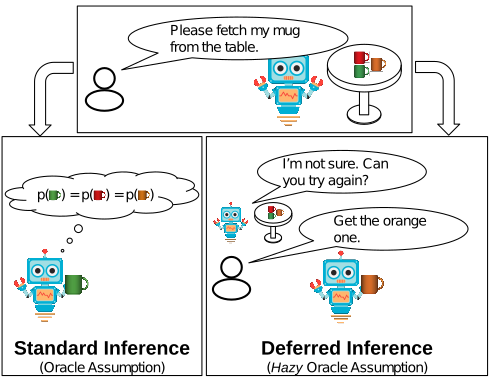
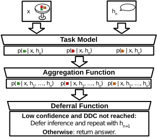

# Evaluating and Improving Interactions with Hazy Oracles
This is the repository for the paper *Evaluating and Improving Interactions with Hazy Oracles*, to be published in the Proceedings of the 2023 AAAI Conference on Artificial Intelligence (AAAI). If you find this work helpful, please cite:

    @inproceedings{lemmer_evaluating_2023,
	address = {Washington DC, United States},
	title = {Evaluating and Improving Interactions with Hazy Oracles},
	booktitle = {Proceedings of the 2023 AAAI Conference on Artificial Intelligence},
	publisher = {AAAI Press},
	author = {Lemmer, Stephan J. and Corso, Jason J.},
	month = February,
	year = {2023}
	}

 
## Abstract
Many AI systems integrate sensor inputs, world knowledge, and human-provided information to perform inference. While such systems often treat the human input as flawless, humans are better thought of as *hazy oracles* whose input may be ambiguous or outside of the AI system's understanding. In such situations it makes sense for the AI system to defer its inference while it disambiguates the human-provided information by, for example, asking the human to rephrase the query. Though this approach has been considered in the past, current work is typically limited to application-specific methods and non-standardized human experiments. We instead introduce and formalize a general notion of deferred inference. Using this formulation, we then propose a novel evaluation centered around the Deferred Error Volume (DEV) metric, which explicitly considers the tradeoff between error reduction and the additional human effort required to achieve it. We demonstrate this new formalization and an innovative deferred inference method on the disparate tasks of Single-Target Video Object Tracking and Referring Expression Comprehension, ultimately reducing error by up to 48% without any change to the underlying model or its parameters.

## Repository Structure
We divide this repository into three sections, based on the underlying application:

1. [VOT](VOT): containing experimental code for the VOT task.
2. [RefExp](RefExp): Containing experimental code for the RefExp task.

We provide the raw output of our models, as well as DR-Error plots at specific DDCs, in [this zip file](https://drive.google.com/file/d/1GNXR6rN6--NHo7jPsENztqfQRu-1t4Qk/view?usp=sharing).

