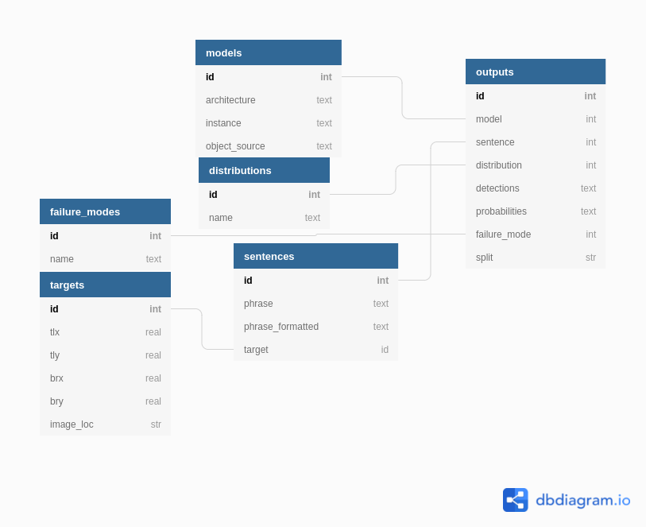

# Referring Expression Comprehension
In this folder, we provide the code and describe the process for producing the values reported in our experiments. All of the data from our experiments is stored in a sqlite file that can be downloaded [here](https://drive.google.com/file/d/1apxjh3pyT64xrS2bFaOMENIekwq7-Z5F/view?usp=sharing). It should be saved as data/redatabase.sqlite3. For both simplicity and replicatability, all of our experiments use this as the starting point, and we describe database details and how to evaluate new models at the end of this README.

## Environment
The conda environment is included in scripts/environment.yaml. It can be created with:

`conda env create -f environment.yaml`

## Generating Runs
Prior to analysis, N runs must be performed for every task. To do this, we run the following code for every aggregation function and DDC constraint (1-10). 

    python generate_performance_pickles.py entropy <aggregation_fn> <split>
 
aggregation functions include:

 - naive\_[DDC]
 - smart\_[DDC]
 - combined\_[DDC]
 - ensemble\_mean\_[DDC]
 - ensemble\_consensus\_[DDC]

Every execution of `generate_performance_pickles.py` generates a pickle with 100 runs, representing all trials for this particular aggregation function. To aggregate them into a single pickle that can be analyzed, run:     
    
    python combine_pickles.py armae_arrays

## Calculating Deferral-Free and Perfect Deferral Errors (Table 1)
To calculate the first input error:
    python calc_deferralfree_acc.py

which produces the output file `accuracies_random.csv`. Note that this is in terms of accuracy, and must be subtracted from one and multiplied by 100 to get percent error.

To calculate the best accuracy (perfect deferral):
    
    python calc_best_acc.py

Again, this is in terms of accuracy, which must be subtracted from one and multiplied by 100 to get percent error. 

## Calculating DEV and err @ rqr1 (Tables 2 and 3)
To calculate the DEV metric and the error at rqr 1, run: 

    python calc_dev.py armae_arrays/compiled.pickle

this produces an output `performance.csv`

## Plotting Marginals (Figure 5)
To produce the marginals plots, run:

    python plot_marginals.py armae_arrays/compiled.pickle

To plot mean error vs. DR for every depth constraint, run:

   python plot\_all.py armae\_arrays/compiled.pickle

## Database Schema and Use
Evaluation scripts are based on model outputs saved to a sqlite database. The database uses the following schema:

A populated database is found [here](https://drive.google.com/file/d/1apxjh3pyT64xrS2bFaOMENIekwq7-Z5F/view?usp=sharing), and should be downloaded to data/redatabase.sqlite3. It can also be be generated from the data/ReDatabase.sql file. To produce the database schema from scratch, first download the refcoco expressions from the (refer api)[https://github.com/lichengunc/refer]. We use refs(unc).p in the refcoco.zip file. And the (MSCOCO dataset)[https://cocodataset.org], then run ``python populate_dataset_tables.py``. Unfortunately, there are a handful of hardlinks in the code that must be addressed.

To populate a new database with UNITER data, we refer to the original [UNITER](https://www.github.com/chenrocks/UNITER) codebase. For other architectures, the included code should be able to perform all required analysis, given the input conforms to the above schema.

